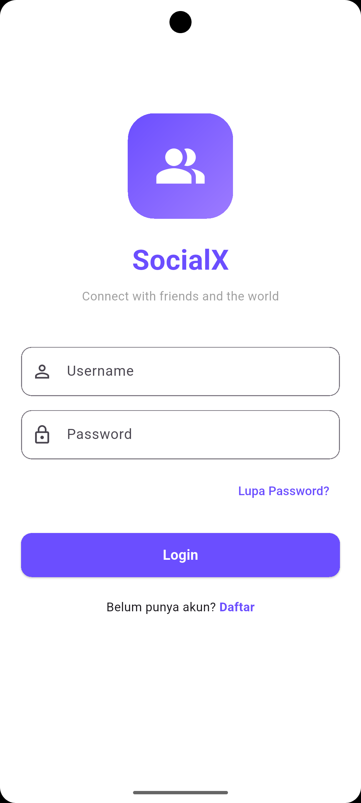
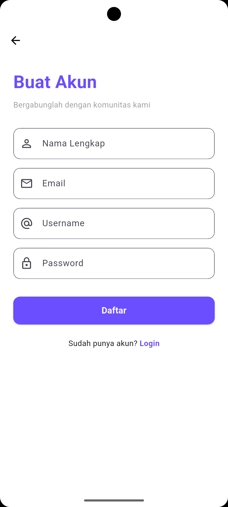
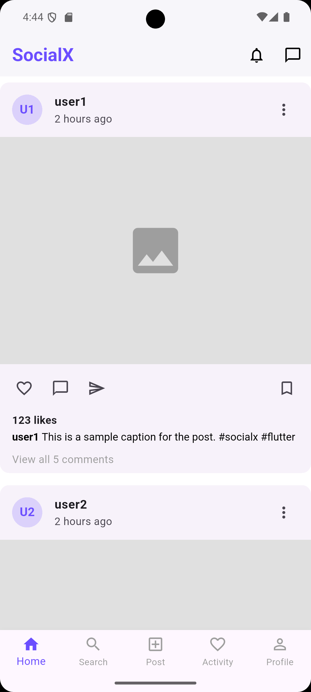
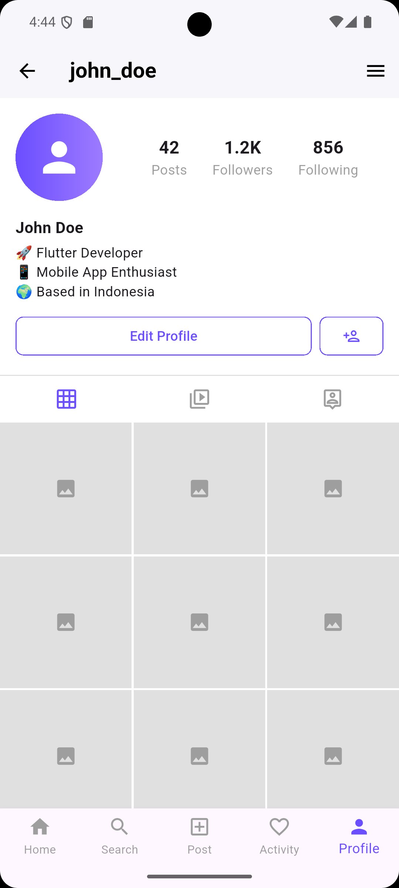
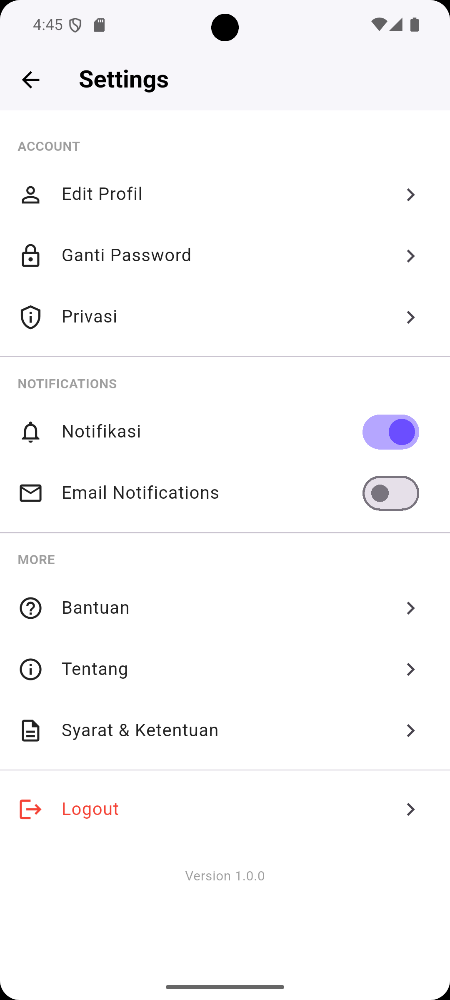
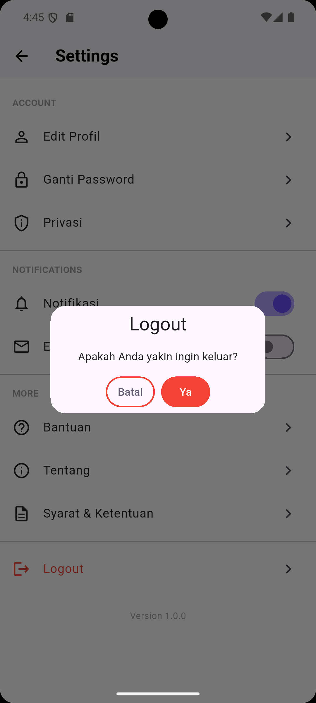

# social_getx

Aplikasi SocialX adalah aplikasi media sosial sederhana yang dibangun menggunakan Flutter dengan framework GetX untuk navigasi dan manajemen state. Aplikasi ini terdiri dari 5 halaman statis yang saling terhubung.

---

### Login

---

### Register

---

### Home

---

### Profile

---

### Settings

---

### Logout

